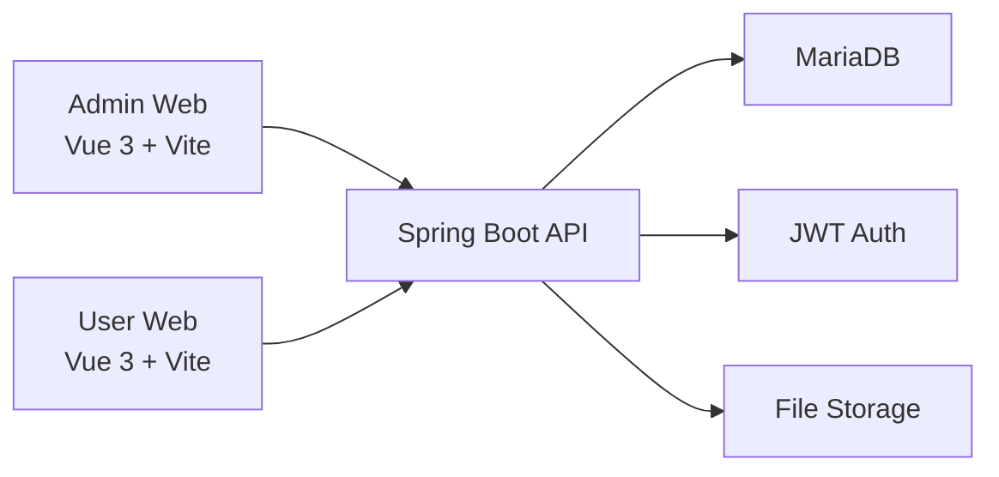

# show_shop1


一个前后端分离的外卖系统训练项目，包含管理后台和用户端两条业务链路。当前版本已经完成核心功能修复、接口契约统一、权限拆分、用户端去 mock 化，以及基础生产准备加固。

## Overview

- 管理后台：员工、分类、菜品、套餐、订单、统计、店铺营业状态
- 用户端：登录、首页、分类、菜品详情、购物车、地址、下单、订单、个人中心
- 本地开发：`MariaDB + Spring Boot + Vue 3 + Vite`
- 公开仓库交付：`README + LICENSE + CHANGELOG + CONTRIBUTING + SECURITY + Logs`

## Highlights

- 后端构建已恢复，支持 `Maven Wrapper`
- 订单主表统一为 `orders`
- 订单查询契约已统一为 `orderNo/customerName/status/beginTime/endTime/page/pageSize`
- 统计页和仪表盘改为真实聚合接口
- 管理端与用户端 token 鉴权已分离
- 用户端核心页面已改为真实接口，不再依赖 mock
- 密码存储已升级为 `BCrypt`，兼容老 `MD5` 首次登录迁移
- `prod` 环境要求显式提供 `JWT_SECRET` 和 CORS 域名配置
- 上传接口已增加扩展名、MIME、大小和图片内容校验

## Tech Stack

- Frontend: `Vue 3`、`Vite`、`Vue Router`、`Pinia`、`Element Plus`、`ECharts`、`Axios`、`Vitest`、`ESLint`
- Backend: `Spring Boot 3.2.4`、`MyBatis`、`MariaDB/MySQL`、`JWT`、`JUnit 5`
- Runtime: `Node.js 18+`、`JDK 17`

## Repository Structure

```text
show_shop1/
├── backend/                Spring Boot 后端
├── frontend/               Vue 3 前端
├── docs/                   文档索引与部署说明
├── project-logs/           修复、交付、发布日志
├── 项目交付说明.md         本地交付与启动说明
├── 项目检查说明.md         项目审计说明
└── README.md               GitHub 首页说明
```

## Architecture



## Feature Status

| 模块 | 状态 | 说明 |
| --- | --- | --- |
| 管理端登录 | 已完成 | 员工登录与管理端鉴权 |
| 分类/菜品/套餐 | 已完成 | 基础 CRUD 已接通 |
| 订单管理 | 已完成 | 查询契约已统一 |
| 仪表盘/统计 | 已完成 | 真实聚合接口已补齐 |
| 用户端登录 | 已完成 | 独立 token 与用户态 |
| 购物车/下单/订单 | 已完成 | 已接真实接口 |
| 地址管理 | 已完成 | 默认地址与增删改 |
| 上传安全 | 已完成 | 白名单、MIME、大小校验 |
| 生产准备 | 已完成基础版 | 密钥、CORS、profile、迁移文档 |

## Quick Start

### 1. Prerequisites

- `JDK 17`
- `Node.js 18+`
- `MariaDB`
- Windows 环境下推荐：
  - 后端使用 `IntelliJ IDEA`
  - 前端使用 `HBuilder X` 或任意代码编辑器
  - 数据库管理使用 `HeidiSQL` 或 `DBeaver`

### 2. Database

开发环境默认连接本机 `MariaDB`：

- Host: `127.0.0.1`
- Port: `3306`
- Database: `cangqiong_takeaway`
- User: `root`

初始化脚本：

- [`backend/db/init.sql`](backend/db/init.sql)

### 3. Start Backend

```bash
cd backend
.\mvnw.cmd test
.\mvnw.cmd -DskipTests compile
.\mvnw.cmd spring-boot:run -Dspring-boot.run.profiles=dev
```

Backend URL:

- `http://localhost:8080`

### 4. Start Frontend

```bash
cd frontend
npm install
npm run lint
npm run test
npm run dev
```

Frontend URL:

- `http://localhost:5173`

### 5. Demo Accounts

管理端：

- Phone: `13800138000`
- Password: `123456`

用户端：

- Phone: `13900139000`
- Password: `123456`

## Production Notes

- 必须显式指定 `SPRING_PROFILES_ACTIVE=prod`
- 必须显式配置 `JWT_SECRET`，且长度至少 32
- 必须显式配置 `APP_CORS_ALLOWED_ORIGINS`
- `prod` 环境禁用 H2、H2 Console 和自动初始化脚本
- 上传文件通过受控接口访问，不直接暴露裸目录

## Documentation

- [项目交付说明](项目交付说明.md)
- [项目检查说明](项目检查说明.md)
- [文档索引](docs/README.md)
- [前端说明](frontend/README.md)
- [部署说明](docs/deployment/production-deploy.md)
- [备份与回滚](docs/deployment/backup-and-rollback.md)
- [变更记录](CHANGELOG.md)
- [贡献说明](CONTRIBUTING.md)
- [安全说明](SECURITY.md)

## Validation

当前仓库已验证：

- Backend: `mvn test`
- Backend: `mvn -DskipTests compile`
- Frontend: `npm run lint`
- Frontend: `npm run test`
- Frontend: `npm run build`

当前仍有两项非阻塞告警：

- Sass `@import` 弃用告警
- 前端 chunk 体积偏大告警

## Roadmap

- 将 Sass `@import` 迁移为 `@use`
- 继续优化前端打包体积
- 增加更多接口级回归测试
- 视训练需求补充截图、演示 GIF 或 API 文档页

## Logs

- [修复总览](project-logs/summary.md)
- [生产准备日志](project-logs/production-readiness.md)
- [交付整理日志](project-logs/delivery-handover.md)
- [GitHub 发布日志](project-logs/github-release.md)
- [环境搭建日志](project-logs/runtime-setup.md)

## License

This project is licensed under the [MIT License](LICENSE).
